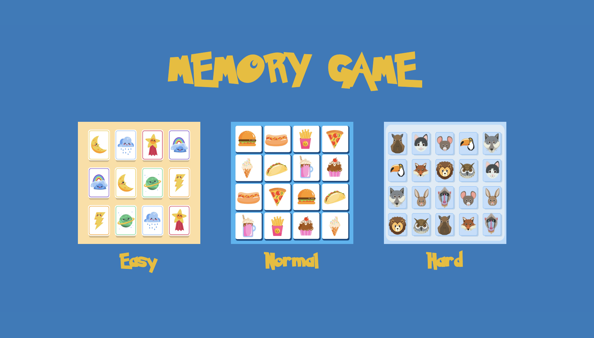
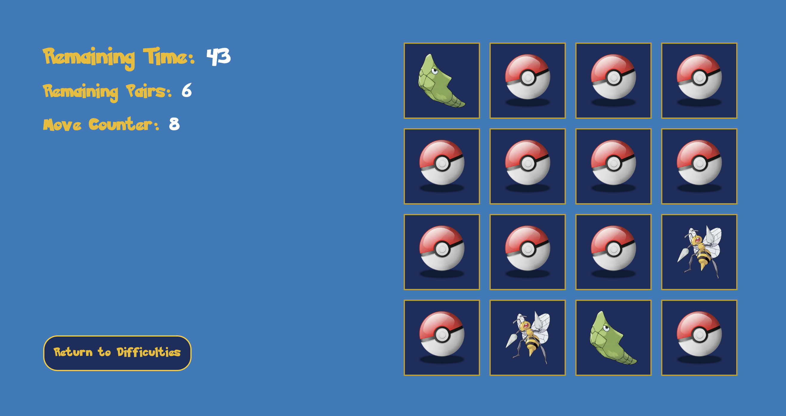
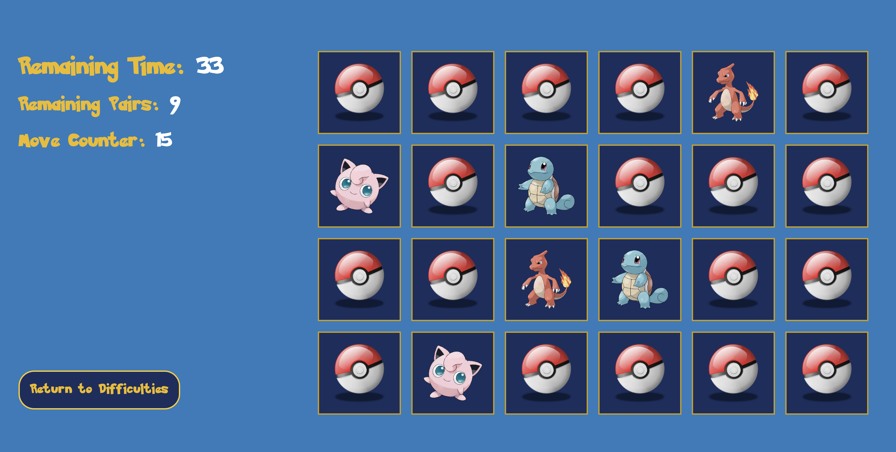
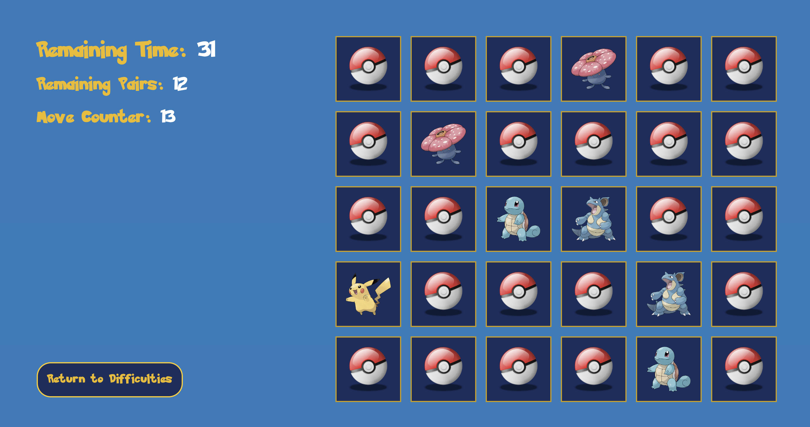

# Memory Game

Classic memory game with Pokémon theme. 

There are 3 difficulties and you have 60 seconds to beat each of them.

It is not possible to play very effectively on mobile devices, but for the sake of responsive design, it also looks decent on mobile.

Can you match the all Pokémons? Have fun!


## Authors

- [@ATErcan](https://www.github.com/ATErcan)
All codes in this project are written by me.


## Tech Stack

HTML, CSS, JavaScript, TypeScript, Next.js, Tailwind, react-confetti, nanoid


## Demo

https://ate-pokememory.vercel.app/









## Installation
All you need is to clone the project and install the dependencies
```bash
  $ git clone https://github.com/ATErcan/memory-game.git

  $ npm install
```
## 🔗 Links
[](https://ate-portfolio-next.vercel.app/)
[](https://www.linkedin.com/in/ahmet-talha-ercan/)